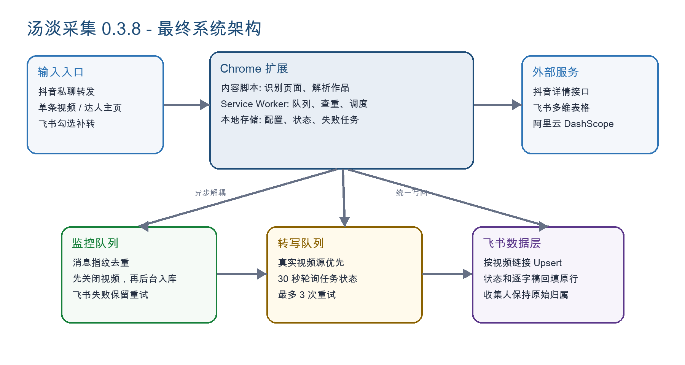

# 技术复盘

本目录保留 v0.3.8 的技术复盘正文，品牌已统一为「汤淡」。当前插件版本及最新使用方法请看仓库首页。

- [系统架构图](architecture.png)
- [完整技术复盘 Word 文档](汤淡采集_抖音监控飞书入库与逐字稿技术复盘_v0.3.8.docx)

文档涉及采集入口、Chrome 后台、飞书写入、消息去重、失败重试与逐字稿任务。维护脚本位于项目根目录；安装使用 Chrome 扩展不需要运行这些 Python 脚本。
